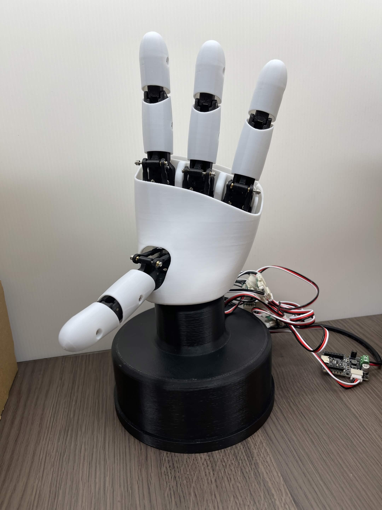

# Roy-AmazingHand-SO101

Roy's fork of **[pollen-robotics/AmazingHand](https://github.com/pollen-robotics/AmazingHand)** —
the open-source 3D-printed 8-DOF / 4-finger robotic hand — brought up on a Raspberry Pi 5 and
extended with our own rustypot tooling, a **hardware-verified motion model**, and a custom
gesture set. Part of the [RoyBot-Lab](https://github.com/roy4222) robot lines (pairs with SO-ARM101
as an expressive hand, **not a gripper**).

> Upstream design © Pollen Robotics. **Licensing preserved (see bottom).** This fork adds
> bring-up evidence, tooling, and docs; it does **not** modify the mechanical design.

## Demo

[](https://youtube.com/shorts/aFw_-3KJ2Zw)

▶️ **[Demo video — whole-hand gestures on the real hand (YouTube Shorts)](https://youtube.com/shorts/aFw_-3KJ2Zw)**
(the photo above also links to it).

---

## What this fork adds

- **Whole-hand bring-up on Pi 5** — 4 fingers / 8× Feetech SCS0009 over rustypot, IDs 1–8,
  per-finger flexion validated, then full-hand integration. Evidence in [`docs/04-run-log/`](docs/04-run-log/).
- **Confirmed motion model** (hardware-verified, not guessed) — see below.
- **Our tooling** in [`bringup/`](bringup/) — gated, readback-verified, bind-aborting scripts for
  scan / set-ID / MiddlePos / single-finger / whole-hand gestures / left-right sway.
- **Custom gesture set** built from our model (`bringup/hand_show.py`).
- **Smooth pose player** (`bringup/hand_pose_player.py`) — cosine-interpolated transitions,
  `safe/natural/snappy` rhythm presets, telemetry (load/temp/status) auto-abort, plays IK trajectories.
- **Looping demo** (`bringup/hand_demo.py`) + a `hand demo` one-liner — continuous, telemetry-safe,
  Ctrl-C returns to open.
- **Offline IK toolchain** (`sim/offline_ik.py`, MuJoCo + mink on WSL) — solve / sweep / generate
  trajectories / human-readable preview / 3D viewer / MP4 render. **sim→real validated**: IK
  trajectories play directly on the real hand.

**Status (2026-06-25):** 8 servos co-existing on the bus; whole-hand flexion re-tested; upstream +
custom gesture libraries reproducible; smooth player + looping demo working; **official IK pipeline
(MuJoCo+mink) closed sim→IK→real hand** — IK-generated motion plays on the real hand (model→servo =
identity, no sign flip). **Air gestures only — no object grasping.** Full detail:
[`docs/04-run-log/2026-06-25-whole-hand-integration-motion-model.md`](docs/04-run-log/2026-06-25-whole-hand-integration-motion-model.md)
and [`docs/10-capability-map.md`](docs/10-capability-map.md).

## Motion model (hardware-verified 2026-06-25)

Each finger is a **parallel mechanism**: 2 servos jointly produce flexion *and* abduction.
Verified on hardware with `bringup/finger_probe.py` + eyes-on:

| two servos | motion |
|---|---|
| **counter-rotate** (opposite sign, e.g. `+90/−90`) | **flexion** — curl / grasp direction (前後抓握) |
| **co-rotate** (same sign, e.g. `+30/+30 ↔ −30/−30`) | **abduction** — left/right (左右搖擺) |

Compose any pose per finger from `(F, L)`:

```
servo1 = F + L      servo2 = -F + L         # diff 2F = flexion, common 2L = abduction
F: -30 (extended) .. +90 (full curl)        L: abduction (only visible near neutral flexion)
```

- **All our gestures are built from this `(F,L)` model — we do not reuse upstream `PythonExample`
  raw angles** (they bake abduction into mixed poses and limit clean left/right).
- **Abduction is geometrically small and flexion-dependent**: it only shows near neutral flexion;
  it's locked out when the finger is extended or curled.
- **IK is wired up** (`sim/offline_ik.py`, MuJoCo + mink, offline on WSL): quantified
  **1° fingertip abduction ≈ 0.72° motor common-mode; real ±20° abduction = ±14° common**. Beyond
  ~±14° common it's past the geometric limit (raw distorts / IK starts coupling in flexion).
  **sim→real mapping = identity** (validated per-finger, no sign flip) → IK trajectories play
  directly via `hand_pose_player AH_TRAJ=… AH_ALLOW_MODEL=1`. Thumb abduction is mechanically tiny.
- ID map: Index = 1,2 / Middle = 3,4 / Ring = 5,6 / Thumb = 7,8. MiddlePos = 0 (horns at neutral).

## Quickstart (our tooling)

Runs on the Pi 5 (`ssh pi5`), Python env `~/amazinghand/.venv` (rustypot 1.5.0, baud 1 M).
**WSL is the source of truth** — edit in `bringup/`, `rsync` to `~/amazinghand/bringup/`.
Motion needs `AH_BRINGUP_ARM=1` (bare run = DRY RUN). **To stop: power off the 5 V supply.**

```bash
# read-only bus scan (no motion)
ssh pi5 'cd ~/amazinghand/bringup && ~/amazinghand/.venv/bin/python bus_scan.py'

# our 10 custom gestures in sequence
ssh pi5 'cd ~/amazinghand/bringup && AH_GESTURE=all AH_BRINGUP_ARM=1 ~/amazinghand/.venv/bin/python hand_show.py'

# smooth pose player (cosine interpolation + telemetry abort; safe/natural/snappy)
ssh pi5 'cd ~/amazinghand/bringup && AH_PRESET=natural AH_BRINGUP_ARM=1 ~/amazinghand/.venv/bin/python hand_pose_player.py'

# looping demo (Ctrl-C stops & returns to open)
ssh -t pi5 'cd ~/amazinghand/bringup && AH_BRINGUP_ARM=1 ~/amazinghand/.venv/bin/python hand_demo.py'
```

A `hand` shell helper (in `~/.zshrc`, not in repo) wraps the demo: `hand demo [safe|natural|snappy]`,
`hand once`, `hand scan`, `hand open`.

**Offline IK (WSL, no hardware)** — generate / preview / view geometrically-correct motion:

```bash
# venv: ~/ah_sim/.venv (mujoco + mink). From repo root:
~/ah_sim/.venv/bin/python sim/offline_ik.py --flex 0 --abd 20        # solve motor angles
~/ah_sim/.venv/bin/python sim/offline_ik.py --traj abd_wave --out ik_abd_wave.csv  # make trajectory
~/ah_sim/.venv/bin/python sim/offline_ik.py --preview ik_abd_wave.csv # human-readable
~/ah_sim/.venv/bin/python sim/offline_ik.py --view abd_wave           # 3D viewer (WSLg)
~/ah_sim/.venv/bin/python sim/offline_ik.py --render abd_wave --out-video ik_abd_wave.mp4
# play an IK trajectory on the REAL hand (model-frame safety gate):
ssh pi5 'cd ~/amazinghand/bringup && AH_TRAJ=ik_abd_wave.csv AH_ALLOW_MODEL=1 AH_BRINGUP_ARM=1 ~/amazinghand/.venv/bin/python hand_pose_player.py'
```

Full tool list, safety, and runs: [`bringup/README.md`](bringup/README.md).

## Docs

Entry order: [`docs/00-overview.md`](docs/00-overview.md) →
[`docs/03-architecture.md`](docs/03-architecture.md) (mechanism + motion model) →
[`docs/10-capability-map.md`](docs/10-capability-map.md) (capability + quantified limits) →
[`docs/04-run-log/`](docs/04-run-log/) (evidence). Index: [`docs/README.md`](docs/README.md).
Hard rules (no fabricated success, unknown = TBD, no secrets, no large files): [`AGENTS.md`](AGENTS.md).

## Hardware / power

- USB-TTL: CH343 (`1a86:55d3`, serial `5B42133808`), addressed by stable by-id path so it can
  never hit the SO-101 adapters.
- Power: **external 5 V (≥2 A)** for the servos — **not** the SO-101 7.4 V rail; common ground
  with the USB-TTL only. SCS0009 ≈ 6 V nominal, ~150 mA no-load, ~1 A stall per servo.

---

## Upstream build resources

This fork does not change the mechanical design — build from upstream:

- **BOM / 3D-printed parts** — see upstream [AmazingHand BOM](https://docs.google.com/spreadsheets/d/1QH2ePseqXjAhkWdS9oBYAcHPrxaxkSRCgM_kOK0m52E/edit?gid=1269903342#gid=1269903342)
  and [3D Printing Guide](docs/AmazingHand_3DprintingTips.pdf).
- **CAD / Onshape / Assembly** — [`docs/AmazingHand_Assembly.pdf`](docs/AmazingHand_Assembly.pdf),
  [`docs/AmazingHand_Overview.pdf`](docs/AmazingHand_Overview.pdf), and upstream [cad/](https://github.com/pollen-robotics/AmazingHand/tree/main/cad).
- **Kits** — [Seeed Studio](https://www.seeedstudio.com/Amazing-Hand-Right-Hand-The-Open-Source-Robotic-Hand-Developer-Kit.html) ·
  [WowRobo](https://shop.wowrobo.com/products/amazing-hand-the-open-source-robotic-hand-kit).
- **Upstream demos / IK** — `PythonExample/`, `ArduinoExample/`, `Demo/` (AHControl, AHSimulation, HandTracking).

## Disclaimer (from upstream, still applies)

Real-life flexion/abduction angles vary from theory (3D-print tolerance, hand-adjusted ball-joint
rods, servo-horn rework, plastic flex). The design is **not** validated for long/complex
prehensile tasks — grasping objects safely needs smart control using the servos' torque/current
feedback. **We keep to air gestures.**

## Credits & License

Upstream **AmazingHand** by [Pollen Robotics](https://github.com/pollen-robotics/AmazingHand) —
huge thanks to [Steve N'Guyen](https://github.com/SteveNguyen) (rustypot Feetech, MuJoCo/Mink,
hand-tracking), [Pierre Rouanet](https://github.com/pierre-rouanet) (pypot Feetech),
Augustin Crampette & Matthieu Lapeyre.

- Code: [Apache 2.0](https://www.apache.org/licenses/LICENSE-2.0)
- Mechanical design: [Creative Commons Attribution 4.0 International (CC BY 4.0)][cc-by]

[![CC BY 4.0][cc-by-shield]][cc-by]

[cc-by]: http://creativecommons.org/licenses/by/4.0/
[cc-by-shield]: https://img.shields.io/badge/License-CC%20BY-lightgrey.svg
